# visual studio code

[visual studio code](https://code.visualstudio.com/)（以下简称vsc）最近更新到了0.8.0版本，新加的一些特性都很nice。多了几个配色方案（流行的monokai配色也有了，虽然效果并不好），也支持自定义安装目录了。最让我感动的是对jsx文件做了语法高亮，写react的时候再也不是一片黑色了。

今天来了兴致，推荐一下，希望有更多的同学来使用这个编辑器。

## 介绍

vsc的宣传语是：

     一个运行于 Mac OS X、Windows和 Linux 之上的，针对于编写现代 Web 和云应用的跨平台源代码编辑器。

按它说的，vsc特别适合来作为前端开发编辑器。

内置html开发神器emmet(zencoding),对css及其相关编译型语言Less和Sass都有很好的支持。

当然，最nice的还是写js代码了，这也是我接下来要着重介绍的功能。

## 特性

- Free但不开源
- Build（构建）和 debug（调试） 现代web和云应用(尤其是JavaScript、TypeScript、C#、ASP.NET v5 和 Nodejs)
- 跨平台支持Linux, Mac OSX, and Windows
- 支持语法自动补全，智能提示
- 内置html开发神器emmet
- 速度非常快
- 支持多主题（配色方案）

## 安装

从 https://code.visualstudio.com/ 下载对应平台的安装文件，安装即可。

如果是mac系统，加简单的命令行

```
[sudo] npm install -g coden
```

当前目录打开vsc编辑器

```
$ vsc
```

## 功能区说明

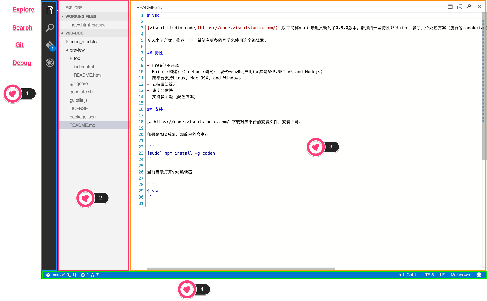

功能区1：4大主菜单

1. Explore
1. Search
1. Git
1. Debug

功能区2：二级菜单

点击每个主菜单都会显示对应的二级菜单，比如Explore就是打开的目录，具体在后面讲解

功能区3：编辑区

我们最常用的编码区

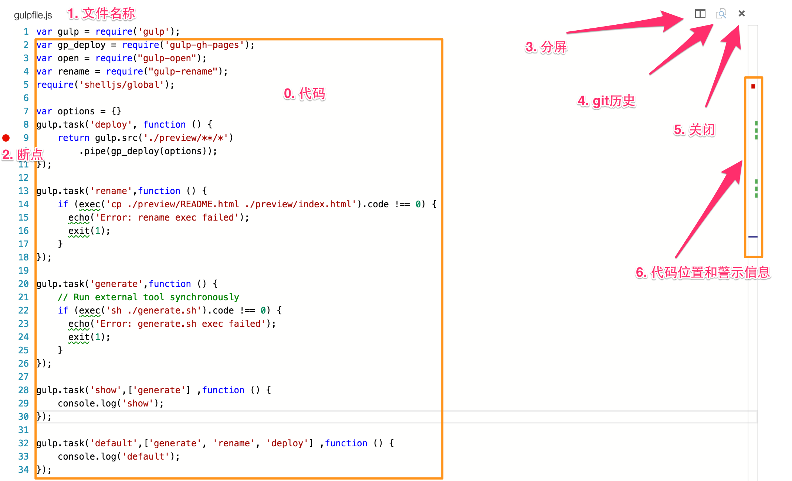

功能区4：信息显示区

当前git信息，格式，字符编码等


```
master+ 0↓ 1↑
```

- master代表当前git分支是master分支
- 0↓ 代表远端repo没有本地的代码信息
- 1↑ 代表本地有1个提交需要push到服务器

点击此处，会弹出

```
git checkout 输入git分支名
```

切换分支,很贴心


语法校验，哪里出错，哪里有警告点击一下此处就都能看到，但不是完全准，算仅供参考吧


- Ln = line 第几行
- Col = column 第几列
- UTF-8 是字符编码
- LF 是换行方式，点击即可切换。 选项说明
  - 1）LF是line feed的缩写，中文意思是换行 
  - 2）CRLF 是carriagereturnlinefeed的缩写。中文意思是回车换行。
- Markdown 代表当前根据后缀识别的语言，用于语法高亮渲染
- ☺ 是意见反馈

## 主菜单说明

### Explore

这个菜单主要是对文件夹和文件的管理

这里有2个概念

1. WORKING FILES
1. DIR

DIR很好理解，就是你当前打开的文件夹

working files是已打开的所有文件，如果此时点击右上角的分屏按钮，可以把文件放到对应的编辑区里。


打开文件夹在菜单里，快捷键command + o

### Search

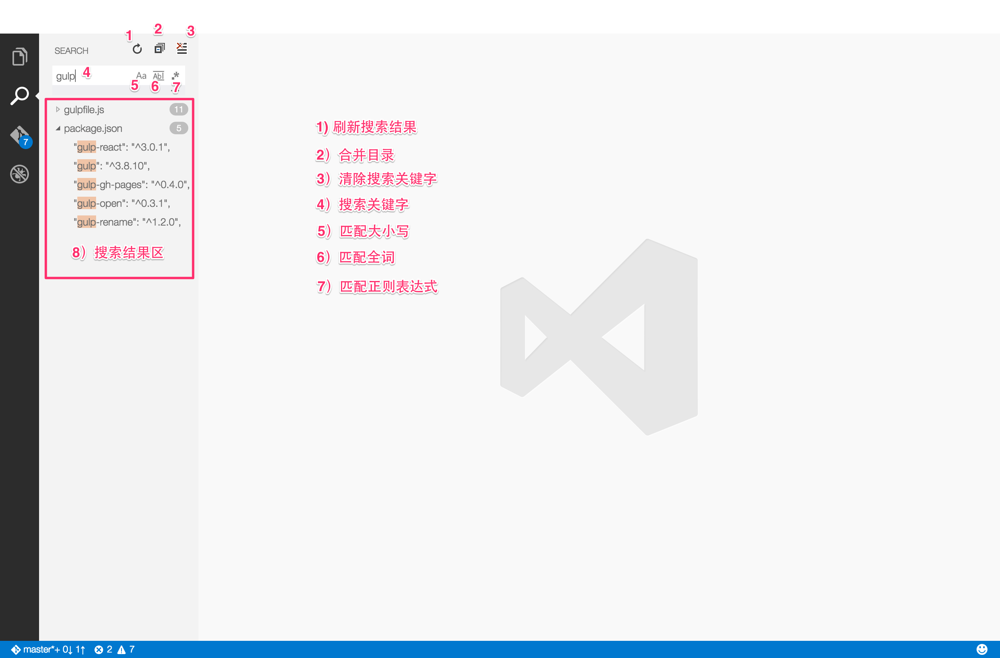


### Git

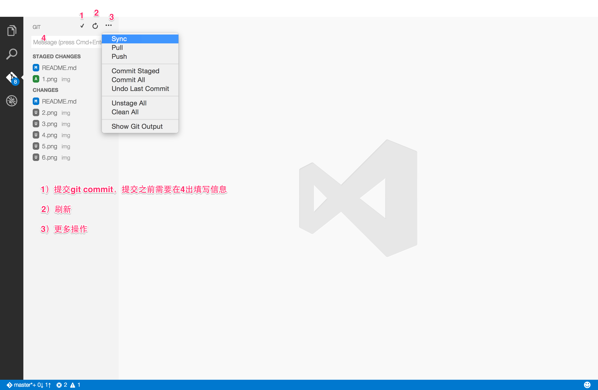

下面给出一些git学习资料（如果熟悉，自动跳过）

- [搬进 Github](http://gitbeijing.com/)
- [git-guide](http://www.bootcss.com/p/git-guide/)
- [git入门gif演示](https://git.oschina.net/wzw/git-quick-start)

### Debug

使用方法也很简单,步骤如下：

- 打开要调试的文件，按f5,编辑器会生成一个launch.json
- 修改launch.json相关内容，主要是name和program字段，改成和你项目对应的
- 点击编辑器左侧长得像蜘蛛的那个按钮
- 点击左上角DEBUG后面的按钮，启动调试
- 打断点，尽情调试（只要你会chrome调试，一模一样）

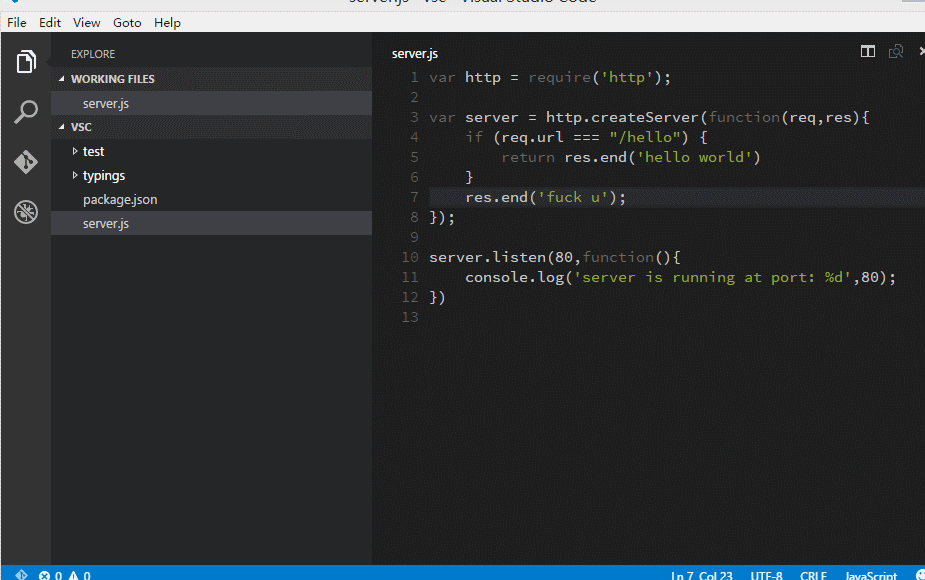


## 实例

通过创建express项目构建，调试来演示vsc的具体用法

### 创建express项目

```
➜  examples git:(master) ✗ express helloworld

   create : helloworld
   create : helloworld/package.json
   create : helloworld/app.js
   create : helloworld/public
   create : helloworld/public/javascripts
   create : helloworld/public/images
   create : helloworld/public/stylesheets
   create : helloworld/public/stylesheets/style.css
   create : helloworld/routes
   create : helloworld/routes/index.js
   create : helloworld/routes/users.js
   create : helloworld/views
   create : helloworld/views/index.jade
   create : helloworld/views/layout.jade
   create : helloworld/views/error.jade
   create : helloworld/bin
   create : helloworld/bin/www

   install dependencies:
     $ cd helloworld && npm install

   run the app:
     $ DEBUG=helloworld:* npm start

➜  examples git:(master) ✗ cd helloworld 
➜  helloworld git:(master) ✗ npm install
➜  helloworld git:(master) ✗ npm start
```

测试express项目是正常的。

说明：如果是自己的项目，需要自己构建git版本控制的，faq里有具体说明。

### 修改launch.json的内容

输入command + t快速定位文件：.vscode/launch.json

修改launch.json的内容

```
{
	"version": "0.1.0",
	// List of configurations. Add new configurations or edit existing ones.
	// ONLY "node" and "mono" are supported, change "type" to switch.
	"configurations": [
		{
			// Name of configuration; appears in the launch configuration drop down menu.
			"name": "Launch helloworld",
			// Type of configuration. Possible values: "node", "mono".
			"type": "node",
			// Workspace relative or absolute path to the program.
			"program": "examples/helloworld/bin/www",
			// Automatically stop program after launch.
			"stopOnEntry": false,
			// Command line arguments passed to the program.
			"args": [],
			// Workspace relative or absolute path to the working directory of the program being debugged. Default is the current workspace.
			"cwd": ".",
			// Workspace relative or absolute path to the runtime executable to be used. Default is the runtime executable on the PATH.
			"runtimeExecutable": null,
			// Optional arguments passed to the runtime executable.
			"runtimeArgs": ["--nolazy"],
			// Environment variables passed to the program.
			"env": {
				"NODE_ENV": "development"
			},
			// Use JavaScript source maps (if they exist).
			"sourceMaps": false,
			// If JavaScript source maps are enabled, the generated code is expected in this directory.
			"outDir": null
		},
		{
			"name": "Attach",
			"type": "node",
			// TCP/IP address. Default is "localhost".
			"address": "localhost",
			// Port to attach to.
			"port": 5858,
			"sourceMaps": false
		}
	]
}
```

核心内容

```
"name": "Launch helloworld",
"type": "node",
"program": "examples/helloworld/bin/www",
```

program是要执行的express的入口。

这里的helloworld是项目，所以找到/bin/www目录即可。

### 点击调试按钮

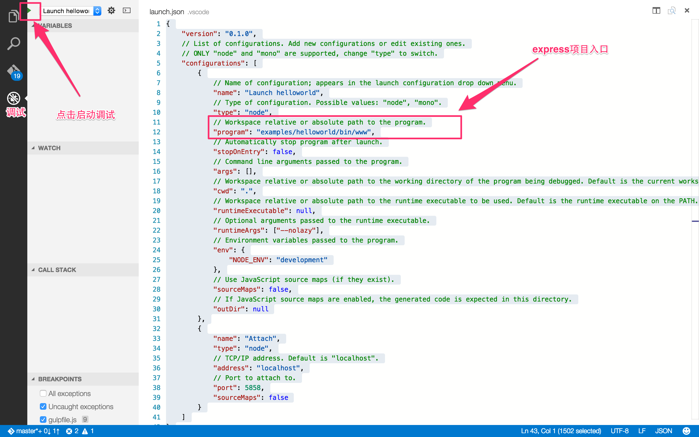

会弹出一个窗口，执行如下命令

```
cd '/Users/sang/workspace/github/vsc-doc'; env 'NODE_ENV=development'   'node' '--debug-brk=44412' '--nolazy' 'examples/helloworld/bin/www'
Debugger listening on port 44412
```

其实node-inspector也是这个原理的。

### 增加断点

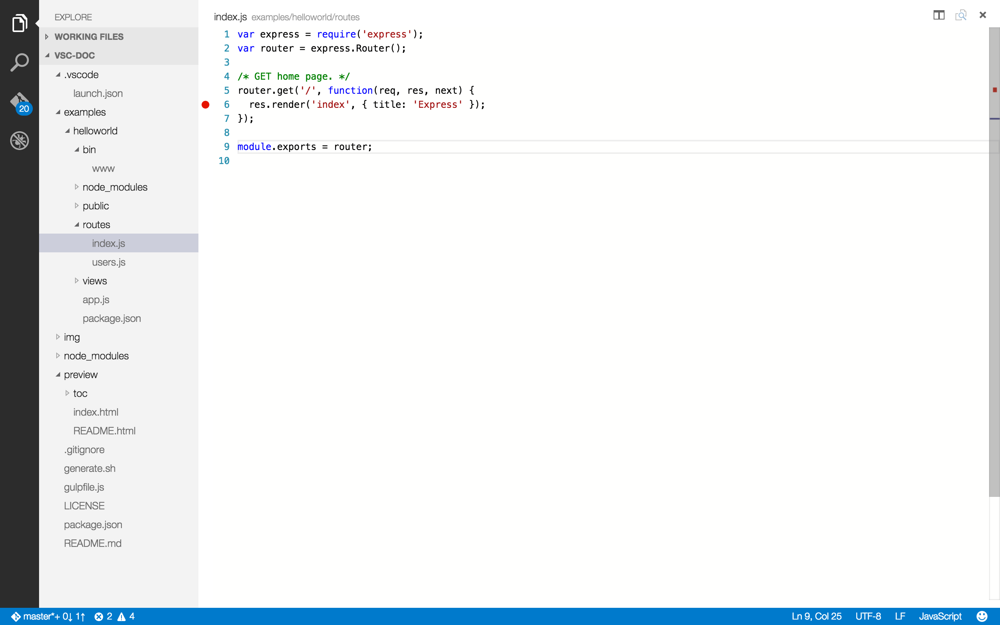

### 此时访问

```
curl http://127.0.0.1:3200/
```

### 进入调试界面

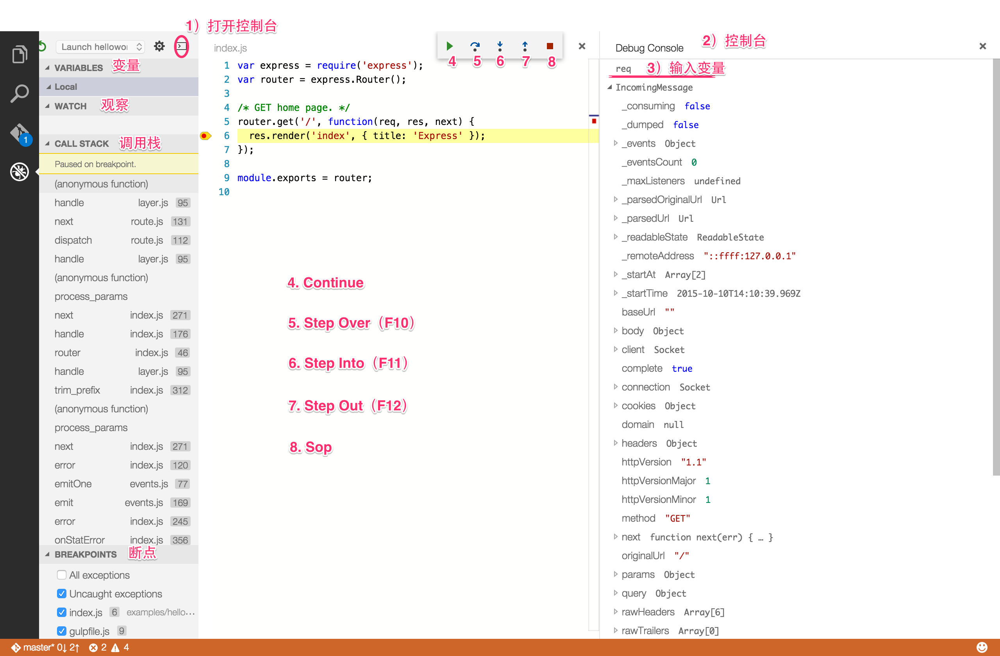

和chrome的调试是一样的。

点击1）处按钮，打开控制台，配合调试，在控制台里查看对应的变量值

另外值得说明的是二级菜单里4个部分

- a）variables变量
- b）watch观察
- c）call stack 调用栈
- d）break points 断点

它和chrome的调试也是一样的，此处就不多讲了。


### 更多

- [node-debug 三法三例之node debugger + node inspector](https://cnodejs.org/topic/5463f6e872f405c829029f7e)
- [node-inspector视频](http://i5ting.github.io/nodejs-video/node-inspector.mov)
- [node-debug视频](http://i5ting.github.io/nodejs-video/node-debug.mov)

## 自动补全(智能提示)

因为之前微软推出了typescript语言，结合tsd文件，用visual studio写typescript代码是相当爽的，智能提示的功能非常nb。

这个功能理所应当也被vsc继承了。

vsc的自动补全用的是tsd。

TSD is a package manager to search and install TypeScript definition files directly from the community driven DefinitelyTyped repository.

https://github.com/DefinitelyTyped/tsd

目前主流的前端类库/框架，包括node.js及其模块/框架都有相应的tsd文件，可以去[DefinitelyTyped](https://github.com/borisyankov/DefinitelyTyped)上找一下。


那么就可以安装tsd之后，使用

```
npm install tsd -g
cd vsc-doc
tsd query -r -o -a install express
```

此时看一下当前目录，下面的express.d.ts文件即是具体提示用的。


```
typings/express/express.d.ts
```

在代码编辑区里，输入CTRL+SPACE就可以有提示了。

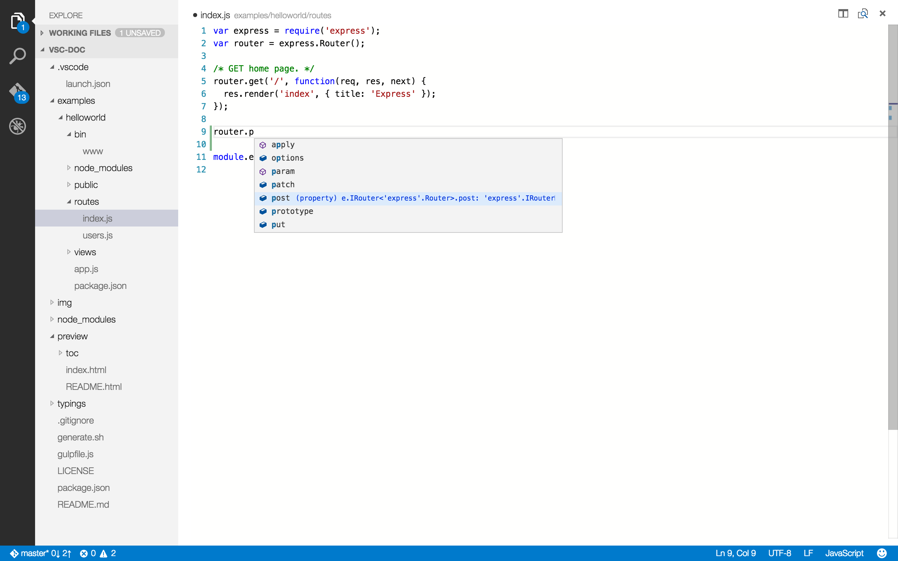

目前node.d.ts版本还是0.12.0，和node v4的api差不了多少


## 自定义快捷键

### 查看快捷键

```
view -> Command Palette
```

对应的快捷键是`shift + command + p`

敲完后，输入`tri`

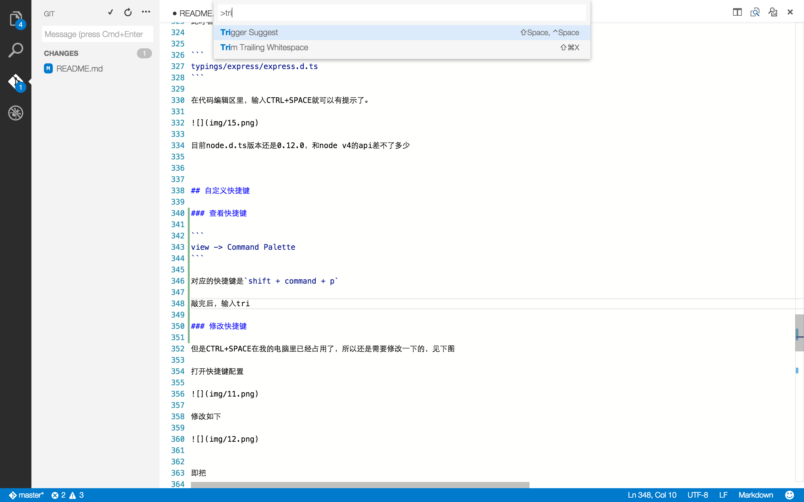

### 修改快捷键

但是CTRL+SPACE在我的电脑里已经占用了，所以还是需要修改一下的，见下图

打开快捷键配置

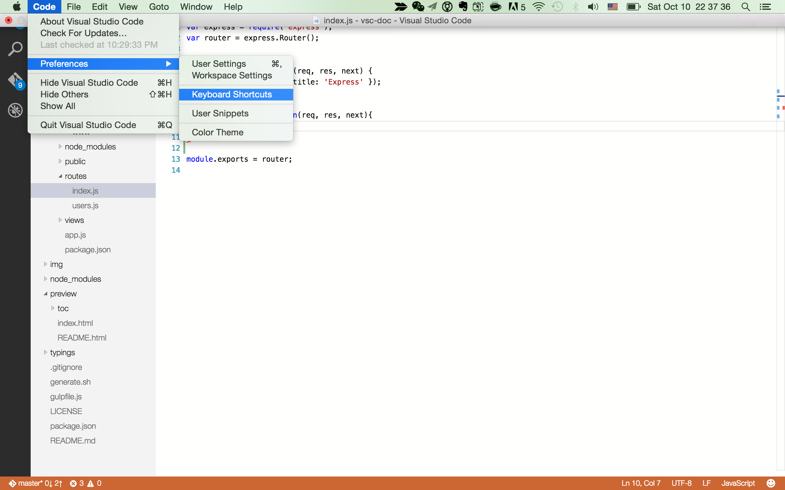

修改如下

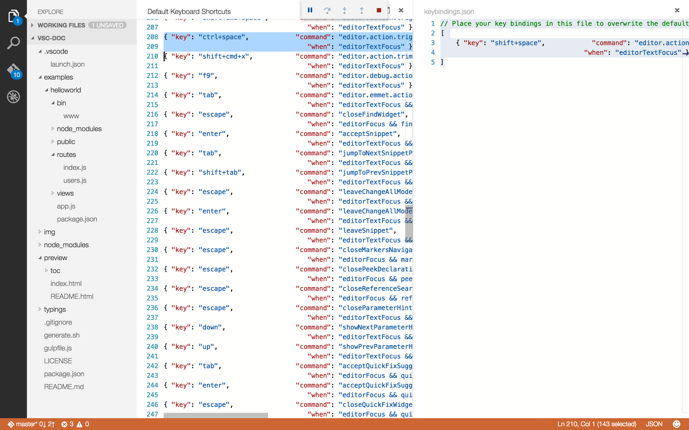


即把

```
// Place your key bindings in this file to overwrite the defaults
[
	{ "key": "ctrl+space",            "command": "editor.action.triggerSuggest",
                                     "when": "editorTextFocus" }
]
```

改成

```
// Place your key bindings in this file to overwrite the defaults
[
	{ "key": "shift+space",            "command": "editor.action.triggerSuggest",
                                     "when": "editorTextFocus" }
]
```

此时，就是输入SHIFT+SPACE就可以有提示了


### 快捷键配置原理
原理说明：我们可以看到2个配置文件，一个是不能修改的，另一个是空的，后面的会把前面的覆盖

这其实和[jquery插件里的配置项](http://i5ting.github.io/How-to-write-jQuery-plugin/build/jquery.plugin.html#10501)原理是类似的

```
// 将defaults 和 options 参数合并到{}
var opts = $.extend({},$.fn.tab.defaults,options);
```

把options里的覆盖$.fn.tab.defaults。


## 快捷键(默认)

- 自动补全    command + SPACE
- 快速打开文件 command + o
- 快速定位文件 command + p
- 分割编辑窗口 command + \ 
- 关闭当前窗口 command + w
- 隐藏二级菜单 command + b
- 放大 command + =
- 缩小 command + -
- 插入表情 ctrl + command + space

搜索

- 当前文档里搜索 command + -
- 所有文档里搜索 shift + command + -

## 语音控制

fn fn

待测

## 自定义主题

打开主题配置

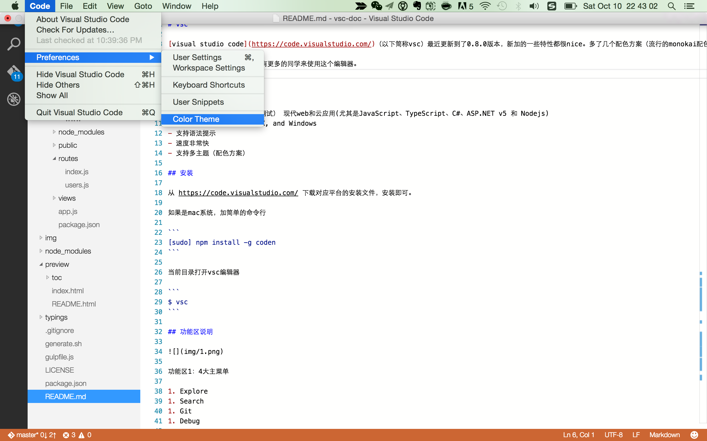

选一个自己喜欢的主题吧

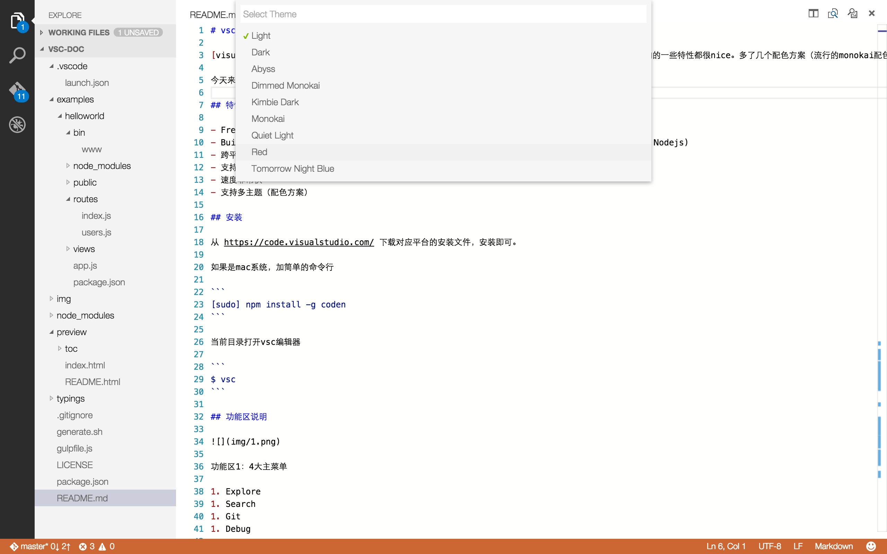

## html开发神器emmet（Zen coding）

举个简单例子，在index.html里

输入link，然后tab键，就会生成下面的代码

```
<link rel="stylesheet" href="">
```


连续输入类和id，比如p.bar#foo，会自动生成： 

```
<p class="bar" id="foo"></p>  
```

输入h1{foo}和a[href=#]，就可以自动生成如下代码：

```
<h1>foo</h1>  
<a href="#"></a>  
```

写html代码足够快了，享受吧，更多用法见 

- http://www.iteye.com/news/27580
- http://docs.emmet.io/

## Node API 查看

在写node.js代码的时候，有时会忘记某个模块中有哪些方法及其用法，经常要去官网翻一下api文档。

这里介绍下怎么使用vsc来搞定这一问题。

1. 打开vsc控制台（Help > Toggle Developer Tools > Console）
1. 在控制台写代码，查询模块方法。

过程如下图：

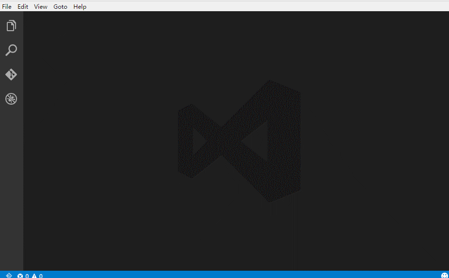

vsc是用atom-shell(现在叫electron)写的，这玩意和node-webkit（现在叫nw.js）一样，都是把node.js和chrome结合起来的工具，所以可以这么使用。

不过vsc使用到的node.js模块并不多，比如引用util和vm等会报错，用node-webkit就不会这样。

## 缓存文件

按照一般app的设计，都是主应用，和用户目录下的缓存文件，把用户自定义的或使用生成的文件都放到缓存文件目录里。鉴于此，我们来找找code.app的缓存文件，或许能发现点有用的东西

### 缓存目录详情

目录是 `/Users/sang/Library/Application Support/Code` 

```
➜  Code  pwd
/Users/sang/Library/Application Support/Code
➜  Code  tree . -L 2
.
├── DevTools Extensions
├── File System
│   ├── 000
│   └── Origins
├── GPUCache
│   ├── data_0
│   ├── data_1
│   ├── data_2
│   ├── data_3
│   └── index
├── Local Storage
│   ├── chrome-devtools_devtools_0.localstorage
│   ├── chrome-devtools_devtools_0.localstorage-journal
│   ├── file__0.localstorage
│   └── file__0.localstorage-journal
├── QuotaManager
├── QuotaManager-journal
├── User
│   ├── keybindings.json
│   ├── launch.json
│   └── snippets
├── databases
│   ├── Databases.db
│   └── Databases.db-journal
└── storage.json

8 directories, 17 files
```

这些文件我们能看懂的就尽量看，看不懂的也无所谓，如果想深度了解里面的机制，还是有必要看看的。

### storage.json

storage.json是code.app的核心配置文件，就像npm里的package.json一样。

看一下具体内容

```
➜  Code  cat storage.json 
{
    "updateChannel": "stable",
    "windowUIState": {
        "width": 1280,
        "height": 773,
        "mode": 1,
        "x": 0,
        "y": 23
    },
    "openedPathsList": {
        "folders": [],
        "files": [
            "/Users/sang/Library/Application Support/Code/User/snippets/javascript.json",
            "/Users/sang/workspace/github/vsc-doc/typings/node/node.d.ts",
            "/Users/sang/workspace/github/vsc-doc",
            "/Users/sang/workspace/github/vsc/index.js",
            "/Users/sang/workspace/moa/rate-cache",
            "/Users/sang/workspace/aircos/aircos-plugins",
            "/Users/sang/workspace/github/vsc",
            "/Users/sang/test/go",
            "/Users/sang/test/go/views"
        ]
    },
    "theme": "vs",
    "folderPickerWorkingDir": "/Users/sang/workspace/moa",
    "lastActiveOpenedPath": "/Users/sang/workspace/github/vsc-doc"
}% 
```

说明

- updateChannel 应该检查版本更新的设置
- windowUIState 界面状态，还记得分割编辑窗口吧？
- openedPathsList 应该是File -> Open Recent里的内容
- theme 用户配色方案
- folderPickerWorkingDir 执行command + o 打开的目录
- lastActiveOpenedPath   最后打开的目录（这个目录是我执行vsc直接打开的）

为什么要了解它呢？

如果你理解了上面的配置起什么作用，那么你是不是可以干很多坏事儿呢？比如

- 备份
- 可视化
- 其他hack

剩下的自己发挥吧

### 当前用户配置

上面的目录结构基本都可以看懂，对应当前用户来说

```
├── User
│   ├── keybindings.json(用户自定义的快捷键)
│   ├── launch.json(调试加载的文件)
│   └── snippets
```

### 用户快捷键

比如快捷键

```
➜  Code  cat User/keybindings.json 
// Place your key bindings in this file to overwrite the defaults
[
	{ "key": "ctrl+f12",                   "command": "editor.action.goToDeclaration",
                                     "when": "editorTextFocus" },
	{ "key": "shift+space",            "command": "editor.action.triggerSuggest",
                                     "when": "editorTextFocus" }
]%       
```

是不是和我们之前配置的一样?

### 用户调试加载的文件

```
User/launch.json
```

和上面的是一样的，就不打印了。如果想每次都定义一下的话，可以自己修改，以后对当前用户就是全局的了

### snippets

User/snippets是snippets存放位置，比如javascript的定义

见

```
User/snippets/javascript.json
```

### 自定义snippet

```
	 // Place your snippets for JavaScript here. Each snippet is defined under a snippet name and has a prefix, body and 
	 // description. The prefix is what is used to trigger the snippet and the body will be expanded and inserted. Possible variables are:
	 // $1, $2 for tab stops, ${id} and ${id:label} and ${1:label} for variables. Variables with the same id are connected.
	 // Example:
	 "Print to console": {
		"prefix": "log",
		"body": [
			"console.log('$1');",
			"$2"
		],
		"description": "Log output to console"
	}
```

说明：

- "Print to console" 是智能提示显示的
- "prefix" 是用户输入的字母，比如本例中输入log自动提示
- 当用户触发此snippet的时候，会按照"body"里代码生成
- $1代表光标位置

自己按照上面的方法定义自己的snippets，可以提高很多工作效率哦

下面看一下如何在代码中使用snippet，如图

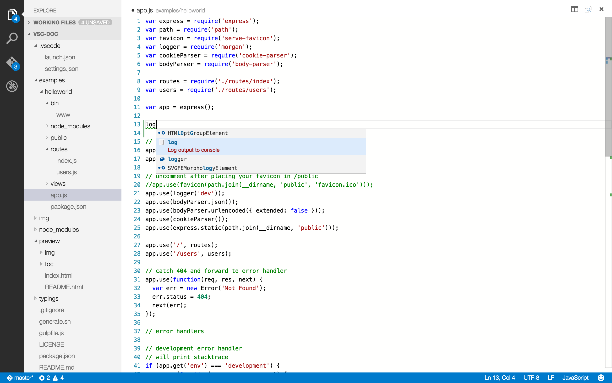

## 庖丁解牛code.app

- electron 打包成可执行文件
- 使用了一些atom模块、第三方模块

app的安装目录是 `/Applications/Visual\ Studio\ Code.app`,右键show package content，然后一层一层的找里面的内容就可以了

```
/Applications/Visual\ Studio\ Code.app/Contents/Resources
```

下面我们来看一下里面的内容

```
➜  Resources  pwd
/Applications/Visual Studio Code.app/Contents/Resources
➜  Resources  tree . -L 3
.
├── Code.icns
├── Credits.rtf
├── app
│   ├── Credits_43.0.2357.65.html
│   ├── ThirdPartyNotices.txt
│   ├── license.txt
│   ├── node_modules
│   │   ├── applicationinsights
│   │   ├── chokidar
│   │   ├── emmet
│   │   ├── first-mate
│   │   ├── getmac
│   │   ├── graceful-fs
│   │   ├── http-proxy-agent
│   │   ├── https-proxy-agent
│   │   ├── iconv-lite
│   │   ├── sax
│   │   ├── semver
│   │   └── winreg
│   ├── out
│   │   ├── bootstrap.js
│   │   └── vs
│   ├── package.json
│   ├── plugins
│   │   ├── declares.d.ts
│   │   ├── lib.core.d.ts
│   │   ├── node.d.ts
│   │   ├── tsconfig.json
│   │   ├── vs.debug.mono
│   │   ├── vs.debug.node
│   │   ├── vs.language.bat
│   │   ├── vs.language.clojure
│   │   ├── vs.language.coffeescript
│   │   ├── vs.language.cpp
│   │   ├── vs.language.csharp
│   │   ├── vs.language.csharp.o
│   │   ├── vs.language.css
│   │   ├── vs.language.dockerfile
│   │   ├── vs.language.fsharp
│   │   ├── vs.language.go
│   │   ├── vs.language.groovy
│   │   ├── vs.language.html
│   │   ├── vs.language.ini
│   │   ├── vs.language.jade
│   │   ├── vs.language.java
│   │   ├── vs.language.javascript
│   │   ├── vs.language.lua
│   │   ├── vs.language.makefile
│   │   ├── vs.language.markdown
│   │   ├── vs.language.objective-c
│   │   ├── vs.language.perl
│   │   ├── vs.language.php
│   │   ├── vs.language.powershell
│   │   ├── vs.language.python
│   │   ├── vs.language.r
│   │   ├── vs.language.ruby
│   │   ├── vs.language.rust
│   │   ├── vs.language.shellscript
│   │   ├── vs.language.swift
│   │   ├── vs.language.tsql
│   │   ├── vs.language.typescript
│   │   ├── vs.language.vb
│   │   ├── vs.language.xml
│   │   ├── vs.language.yaml
│   │   ├── vs.linter.eslint
│   │   ├── vs.linter.jshint
│   │   └── vs.theme.starterkit
│   └── vso.png
├── atom.asar
├── en.lproj
├── en_GB.lproj
├── file.icns
├── zh_CN.lproj
└── zh_TW.lproj

60 directories, 14 files
```


### 依赖的模块

```
│   ├── node_modules
│   │   ├── applicationinsights
│   │   ├── chokidar
│   │   ├── emmet
│   │   ├── first-mate
│   │   ├── getmac
│   │   ├── graceful-fs
│   │   ├── http-proxy-agent
│   │   ├── https-proxy-agent
│   │   ├── iconv-lite
│   │   ├── sax
│   │   ├── semver
│   │   └── winreg
```

### 插件

```
│   ├── plugins
│   │   ├── declares.d.ts
│   │   ├── lib.core.d.ts
│   │   ├── node.d.ts
│   │   ├── tsconfig.json
│   │   ├── vs.debug.mono
│   │   ├── vs.debug.node
│   │   ├── vs.language.bat
│   │   ├── vs.language.clojure
│   │   ├── vs.language.coffeescript
│   │   ├── vs.language.cpp
│   │   ├── vs.language.csharp
│   │   ├── vs.language.csharp.o
│   │   ├── vs.language.css
│   │   ├── vs.language.dockerfile
│   │   ├── vs.language.fsharp
│   │   ├── vs.language.go
│   │   ├── vs.language.groovy
│   │   ├── vs.language.html
│   │   ├── vs.language.ini
│   │   ├── vs.language.jade
│   │   ├── vs.language.java
│   │   ├── vs.language.javascript
│   │   ├── vs.language.lua
│   │   ├── vs.language.makefile
│   │   ├── vs.language.markdown
│   │   ├── vs.language.objective-c
│   │   ├── vs.language.perl
│   │   ├── vs.language.php
│   │   ├── vs.language.powershell
│   │   ├── vs.language.python
│   │   ├── vs.language.r
│   │   ├── vs.language.ruby
│   │   ├── vs.language.rust
│   │   ├── vs.language.shellscript
│   │   ├── vs.language.swift
│   │   ├── vs.language.tsql
│   │   ├── vs.language.typescript
│   │   ├── vs.language.vb
│   │   ├── vs.language.xml
│   │   ├── vs.language.yaml
│   │   ├── vs.linter.eslint
│   │   ├── vs.linter.jshint
│   │   └── vs.theme.starterkit
```

很多人抱怨，vsc没有提供插件机制，想想还是笑笑吧，机制已经很健全了，开放只是早晚的事儿。

### out目录

out是一个比较有趣的目录，所有代码都是混淆过的，但可以从其文件名和目录名称看出一些东西

```
➜  out  pwd
/Applications/Visual Studio Code.app/Contents/Resources/app/out
➜  out  tree . -L 3
.
├── bootstrap.js
└── vs
    ├── base
    │   ├── browser
    │   ├── common
    │   ├── node
    │   ├── parts
    │   └── worker
    ├── css.js
    ├── editor
    │   ├── browser
    │   ├── common
    │   ├── contrib
    │   └── css
    ├── languages
    │   ├── annotatedLanguage
    │   ├── csharp
    │   ├── css
    │   ├── handlebars
    │   ├── html
    │   ├── javascript
    │   ├── json
    │   ├── less
    │   ├── lib
    │   ├── markdown
    │   ├── php
    │   ├── plaintext
    │   ├── razor
    │   ├── sass
    │   ├── typescript
    │   ├── typescript.workbench
    │   └── vsxml
    ├── loader.js
    ├── nls.js
    ├── text.js
    └── workbench
        ├── browser
        ├── electron-browser
        ├── electron-main
        ├── parts
        ├── services
        ├── workbench.main.css
        ├── workbench.main.js
        ├── workbench.main.nls.js
        └── workbench.main.nls.keys.js

36 directories, 9 files
```

bootstrap.js是启动的脚本


默认支持的语言

- annotatedLanguage
- csharp
- css
- handlebars
- html
- javascript
- json
- less
- markdown
- php
- plaintext
- razor
- sass
- typescript
- vsxml

vs/base/browser/ui/是界面里用的svg图，如果想自定义界面可以自行修改

vs/base/node/terminateProcess.sh写的不错

```
#!/bin/bash

terminateTree() {
    for cpid in $(pgrep -P $1); do
        terminateTree $cpid
    done
    kill -9 $1 > /dev/null 2>&1
}

for pid in $*; do
    terminateTree $pid
done
```


/Applications/Visual Studio Code.app/Contents/Resources/app/out/vs/editor/css是编辑器vs-theme.css样式


/Applications/Visual Studio Code.app/Contents/Resources/app/out/vs/workbench/browser/css是workbench的vs-theme.css样式

### ThirdPartyNotices.txt

看看它依赖的第三方开源模块

```
1.	amdefine version 1.0.0 (https://github.com/jrburke/amdefine)
2.	anymatch version 1.3.0 (https://github.com/es128/anymatch)
3.	App Insights for Node.js version 0.15.5 (https://github.com/Microsoft/ApplicationInsights-node.js/tree/master)
4.	array-slice version 0.2.3 (https://github.com/jonschlinkert/array-slice)
5.	arr-diff version 1.0.1 (https://github.com/jonschlinkert/arr-diff/tree/1.0.1)
6.	arrify version 1.0.0 (https://github.com/sindresorhus/arrify)
7.	Async-each version 0.1.6 (https://github.com/paulmillr/async-each)
8.	atom-brightray (https://github.com/atom/brightray)
9.	binary-extensions version 1.3.1 (https://github.com/sindresorhus/binary-extensions)
10.	braces version 1.8.0 (https://github.com/jonschlinkert/braces)
11.	chjj-marked version 0.3.2 (https://github.com/npmcomponent/chjj-marked)
12.	chokidar version 1.0.0 (https://github.com/paulmillr/chokidar)
13.	chromium version 43.0.2357.65 (http://www.chromium.org/Home)
14.	Colorsublime-Themes version 0.1.0 (https://github.com/Colorsublime/Colorsublime-Themes)
15.	Core-util-is version 1.0.1 (https://github.com/isaacs/core-util-is/)
16.	debug version 2.2.0 (https://github.com/visionmedia/debug)
17.	debug version 1.0.4 (https://github.com/visionmedia/debug)
18.	debugger-libs version 9.0.21022 (https://github.com/mono/debugger-libs)
19.	electron version 0.27.3 (https://github.com/atom/electron)
20.	emmet version 1.3.1 (https://github.com/emmetio/emmet)
21.	expand-brackets version 0.1.1 (https://github.com/jonschlinkert/expand-brackets)
22.	expand-range version 1.8.1 (https://github.com/jonschlinkert/expand-range)
23.	Extract-opts version 2.2.0 (https://github.com/bevry/extract-opts)
24.	filename-regex version 2.0.0 (https://github.com/regexps/filename-regex)
25.	fill-range version 2.2.2 (https://github.com/jonschlinkert/fill-range)
26.	firstmate (alexandrudima) version 4.1.7 (https://github.com/alexandrudima/first-mate)
27.	for-in version 0.1.4 (https://github.com/jonschlinkert/for-in)
28.	for-own version 0.1.3 (https://github.com/jonschlinkert/for-own)
29.	fsevents version 0.3.6 (https://github.com/strongloop/fsevents)
30.	getmac version 1.0.7 (https://github.com/bevry/getmac)
31.	glob-base version 0.2.0 (https://github.com/jonschlinkert/glob-base)
32.	glob-parent version 1.2.0 (https://github.com/es128/glob-parent)
33.	graceful-fs version 4.1.2 (https://github.com/isaacs/node-graceful-fs)
34.	http-proxy-agent version 0.2.6 (https://github.com/TooTallNate/node-http-proxy-agent)
35.	https-proxy-agent version 0.3.5 (https://github.com/TooTallNate/node-https-proxy-agent)
36.	iconv-lite version 0.4.10 (https://github.com/ashtuchkin/iconv-lite)
37.	Inherits version 2.0.1 (https://github.com/isaacs/inherits)
38.	Isarray version 0.0.1 (https://github.com/juliangruber/isarray)
39.	is-binary-path version 1.0.1 (https://github.com/sindresorhus/is-binary-path)
40.	is-dotfile version 1.0.1 (ttps://github.com/jonschlinkert/is-dotfile)
41.	Is-equal-shallow version 0.1.2 (https://github.com/jonschlinkert/is-equal-shallow)
42.	is-extglob version 1.0.0 (https://github.com/jonschlinkert/is-extglob)
43.	is-glob version 1.1.3 (https://github.com/jonschlinkert/is-glob)
44.	is-number version 1.1.2 (https://github.com/jonschlinkert/is-number)
45.	isobject version 1.0.0 (https://github.com/jonschlinkert/isobject)
46.	isobject version 0.2.0 (https://github.com/jonschlinkert/isobject)
47.	Is-primitive version 1.0.0 (https://github.com/jonschlinkert/is-primitive)
48.	Is-primitive version 2.0.0 (https://github.com/jonschlinkert/is-primitive)
49.	issrc (Inno Setup) version 5.5.6 (https://github.com/jrsoftware/issrc)
50.	jsbeautifer version 1.5.10 (https://github.com/beautify-web/js-beautify)
51.	kind-of version 1.1.0 (https://github.com/jonschlinkert/kind-of)
52.	language-closure version 0.16.0 (https://github.com/atom/language-clojure)
53.	language-groovy version 0.4.0 (https://github.com/Jakehp/language-groovy)
54.	language-make version 0.17.0 (https://github.com/atom/language-make)
55.	language-perl version 0.28.0 (https://github.com/atom/language-perl)
56.	language-php version 0.29.0 (https://github.com/atom/language-php)
57.	language-rust version 0.4.4 (https://github.com/zargony/atom-language-rust)
58.	language-shellscript version 0.15.0 (https://github.com/atom/language-shellscript)
59.	language-yaml version 0.24.0 (https://github.com/atom/language-yaml)
60.	Libchromiumcontent version 43.0.2357.65 (https://github.com/atom/libchromiumcontent)
61.	Lru-cache version 2.6.4 (https://github.com/isaacs/node-lru-cache)
62.	micromatch version 2.1.6 (https://github.com/jonschlinkert/micromatch/tree/2.1.5)
63.	minimatch version 0.2.14 (https://github.com/isaacs/minimatch)
64.	ms version 0.7.1 (https://github.com/rauchg/ms.js)
65.	ms.js version 0.6.2 (https://github.com/rauchg/ms.js)
66.	nan version 1.8.4 (https://github.com/iojs/nan)
67.	newtonsoft.json version 6.0.8 (https://github.com/JamesNK/Newtonsoft.Json)
68.	node-agent-base version 1.0.1 (https://github.com/TooTallNate/node-agent-base/)
69.	node-extend version 1.2.1 (https://github.com/justmoon/node-extend)
70.	NodeJS version 0.10.29 (http://nodejs.org/dist/v0.10.29/)
71.	node-oniguruma (alexandrudima) version 4.1.0 (https://github.com/alexandrudima/node-oniguruma)
72.	node-oniguruma (atom) version 4.1.0 (https://github.com/atom/node-oniguruma)
73.	Node-semver (aka semver) version 4.3.4 (https://github.com/npm/node-semver)
74.	NRefactory version 10.0.0 (https://github.com/icsharpcode/NRefactory)
75.	object.omit version 0.2.1 (https://github.com/jonschlinkert/object.omit)
76.	Omnisharp-roslyn version 1.1.1 (https://github.com/OmniSharp/omnisharp-roslyn)
77.	oniguruma version 5.9.3 (http://www.geocities.jp/kosako3/oniguruma/)
78.	parse-glob version 3.0.2 (https://github.com/jonschlinkert/parse-glob)
79.	preserve version 0.2.0 (https://github.com/jonschlinkert/preserve)
80.	randomatic version 1.1.0 (https://github.com/jonschlinkert/randomatic)
81.	react version 0.12.0 (https://github.com/facebook/react)
82.	Readable-stream version 1.0.33 (https://github.com/iojs/readable-stream)
83.	Readdirp version 1.3.0 (https://github.com/thlorenz/readdirp)
84.	regex-cache version 0.4.2 (https://github.com/jonschlinkert/regex-cache)
85.	repeat-element version 1.1.2 (https://github.com/jonschlinkert/repeat-element)
86.	repeat-string version 1.5.2 (https://github.com/jonschlinkert/repeat-string)
87.	sax version 1.1.1 (https://github.com/isaacs/sax-js)
88.	SDB version 1.4 (https://github.com/mono/sdb)
89.	Sigmund version 1.0.1 (https://github.com/isaacs/sigmund)
90.	source-map version 0.4.4 (https://github.com/mozilla/source-map)
91.	String_decoder version 0.10.31 (https://github.com/rvagg/string_decoder)
92.	stringScore version 0.1.10 (https://github.com/joshaven/string_score)
93.	Typechecker version 2.0.8 (https://github.com/bevry/typechecker)
94.	typescript version 1.5 (https://github.com/Microsoft/TypeScript/)
95.	typescript-sublime-plugin version 0.1.5 (https://github.com/Microsoft/TypeScript-Sublime-Plugin)
96.	underscore version 1.8.2 (https://github.com/jashkenas/underscore)
97.	vscode-swift (https://github.com/owensd/vscode-swift)
98.	winreg version 0.0.12 (https://github.com/fresc81/node-winreg)
```

注意一下里面atom相关的模块

### package.json

```
{
  "name": "Code",
  "version": "0.8.0",
  "author": {
    "name": "Microsoft Corporation"
  },
  "main": "./out/vs/workbench/electron-main/bootstrap",
  "private": true,
  "engines": {
    "node": ">= 0.10.0 < 0.11.0"
  },
  "dependencies": {
    "applicationinsights": "0.15.5",
    "chokidar": "^1.0.0",
    "emmet": "^1.3.0",
    "first-mate": "git://github.com/alexandrudima/first-mate.git#c75bbe40b66b3560104faf399880c35683d7283d",
    "getmac": "1.0.7",
    "graceful-fs": "4.1.2",
    "http-proxy-agent": "^0.2.6",
    "https-proxy-agent": "^0.3.5",
    "iconv-lite": "^0.4.7",
    "sax": "^1.1.1",
    "semver": "^4.2.0",
    "winreg": "0.0.12"
  },
  "devDependencies": {
    "async": "^1.4.0",
    "atom-shell-installer-assets": "^0.2.0",
    "azure-storage": "^0.3.1",
    "crud-file-server": "^0.6.0",
    "debounce": "^1.0.0",
    "event-stream": "^3.1.7",
    "express": "^4.13.1",
    "glob": "^5.0.13",
    "gulp": "^3.8.9",
    "gulp-atom-electron": "^0.17.1",
    "gulp-azure-storage": "^0.3.0",
    "gulp-bom": "^1.0.0",
    "gulp-filter": "^3.0.0",
    "gulp-json-editor": "^2.2.1",
    "gulp-mocha": "^2.1.3",
    "gulp-rename": "^1.2.0",
    "gulp-symdest": "^1.0.0",
    "gulp-tsb": "git://github.com/jrieken/gulp-tsb.git#40f34810a95708c1bbc1433ceecb01203bf2819c",
    "gulp-vinyl-zip": "^1.0.3",
    "gulp-watch": "^4.2.4",
    "innosetup-compiler": "^5.5.60",
    "istanbul": "^0.3.17",
    "jsdom-no-contextify": "^3.1.0",
    "mime": "1.2.11",
    "minimatch": "^2.0.10",
    "mkdirp": "^0.5.0",
    "mocha": "^2.2.5",
    "optimist": "0.3.5",
    "queue": "3.0.6",
    "requirejs": "2.1.9",
    "rimraf": "^2.2.8",
    "uglify-js": "2.4.8",
    "underscore": "^1.8.2",
    "vinyl": "^0.4.5"
  },
  "update": {
    "baseUrl": "https://ticino-builds.azurewebsites.net"
  },
  "commit": "7917414ff6ec7255dc60b2f7881e5178966e864e",
  "date": "2015-09-07T10:53:44.750Z"
}
```

## FAQ

### 如何添加git地址？

vsc其实不管你的git初始化的，只要你当前是git管理的，它的git部分才有用。

也就是说git需要自己处理。

比如

```
express helloworld
cd helloworld
git init
git remote add origin git@github.com:ashtuchkin/iconv-lite.git
git add .
git commit -am 'init'
```

如果要切换分支，可以用checkout命令

```
git checkout -b dev
```

如果是已有分支就

```
git checkout dev
```

### 怎么让语法检查器支持es6的语法呢？


要支持es6的话，需要在项目下建一个jsconfig.json，内容为

```
{
    "compilerOptions":{
        "target":"ES6",
        "module":"commonjs"
    }
}
```

嫌麻烦的话可以安装下@hellopao 写的模块[jsf](https://www.npmjs.com/package/jsf)，通过命令行来生成该文件

```
npm install jsf -g
jsf
```

### 图片没有路径选择提示么？

目前还没有，需要等


## 结语

vsc和其他编辑器（sublime text,atom,webstorm等）相比，某些方面还存在很多问题。对于一个前端工程师来说，它已经足够好了。

推荐使用~


## TODO

- 0.8.1
- VS Code v0.9.1 (October 2015) https://code.visualstudio.com/updates#VSCode


### markdown preview

0.9+开始增加了markdown预览功能，试用了一下，还是非常不错得

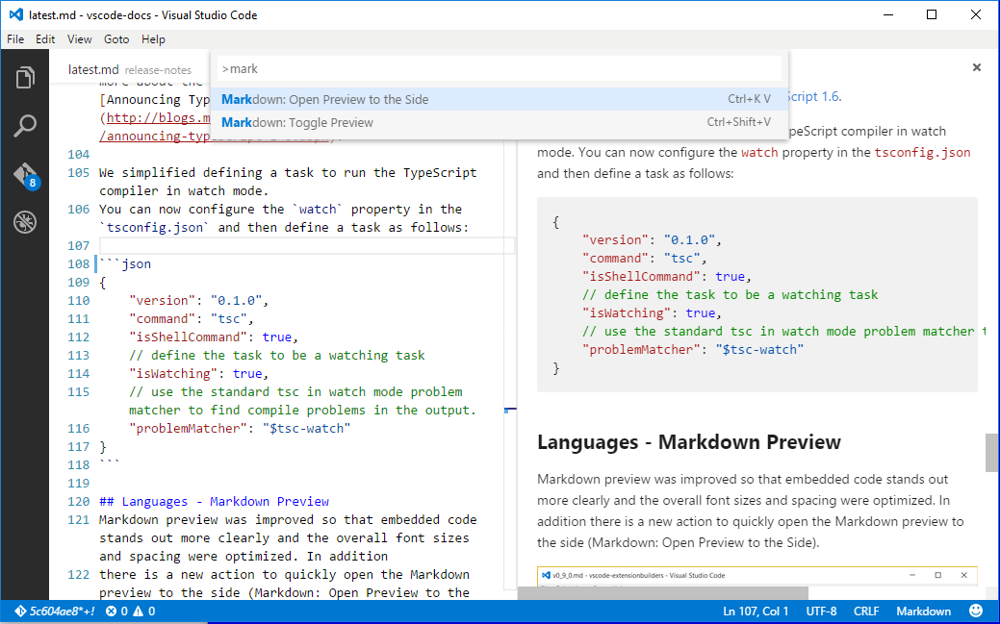


上面的命令，可以翻译一下

- 新建split窗口
- 讲当前markdown切换到预览模式

```
command + \
shift + command +v
```

